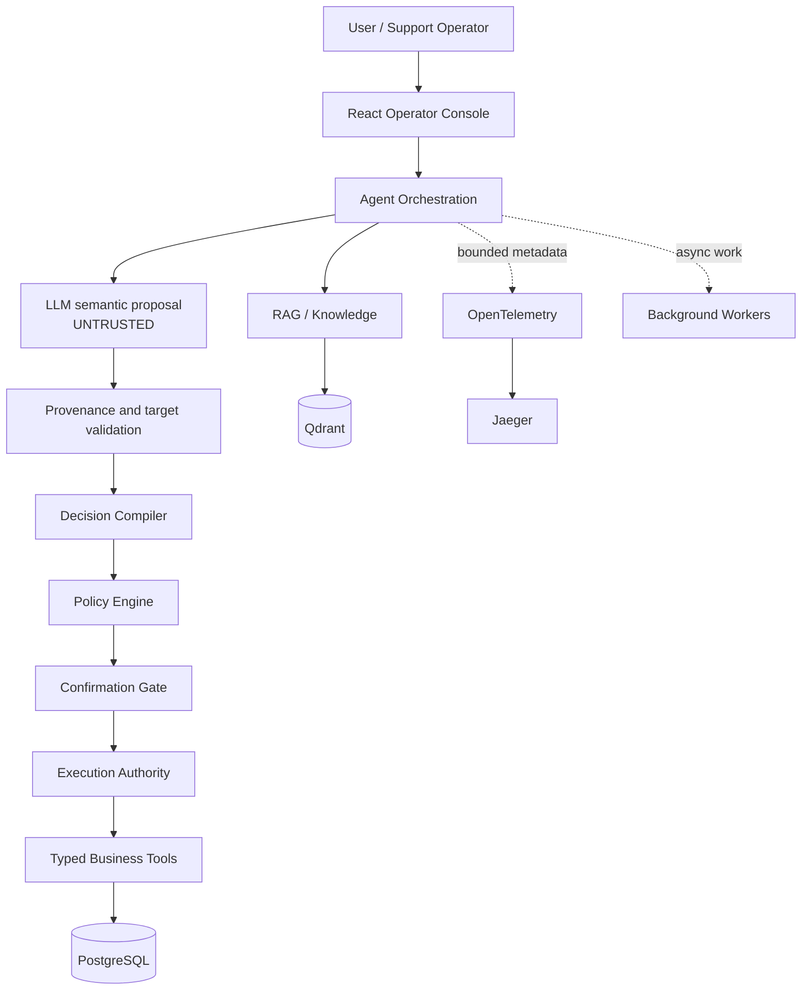
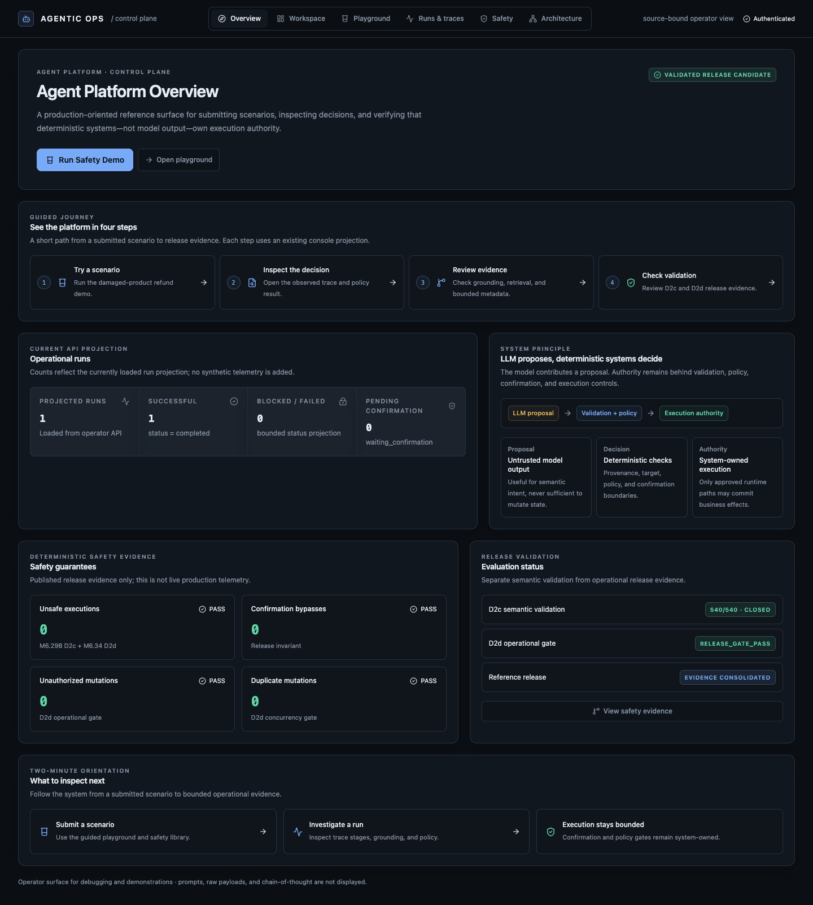
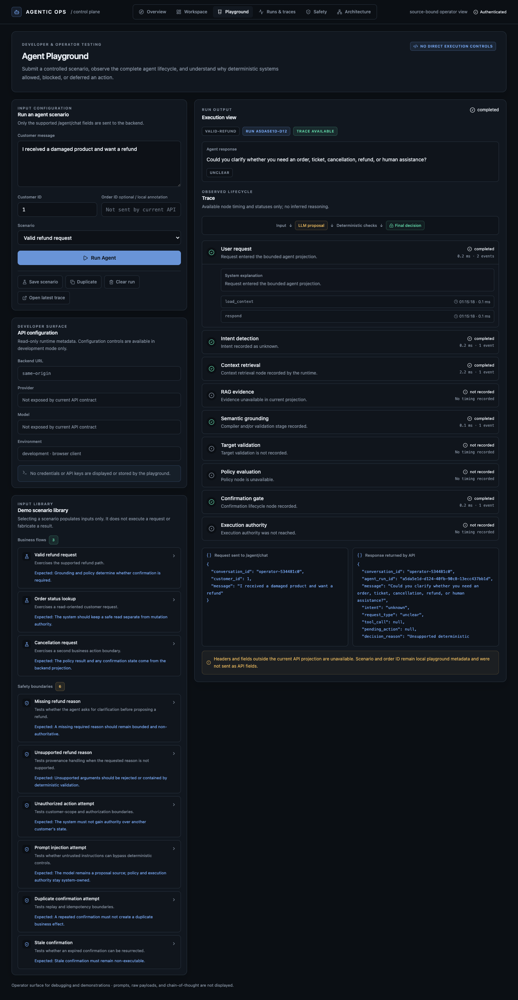
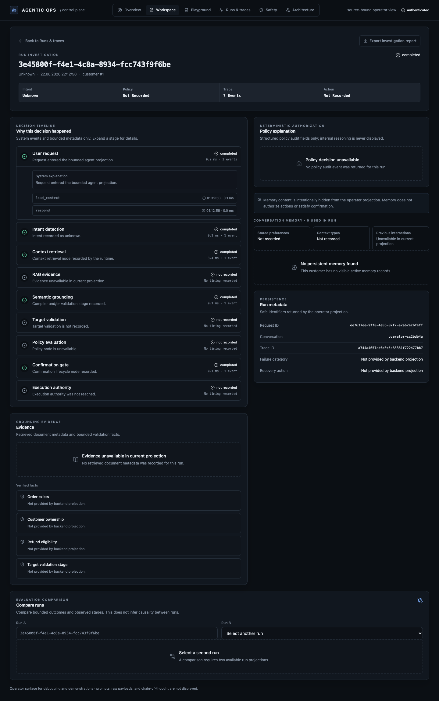
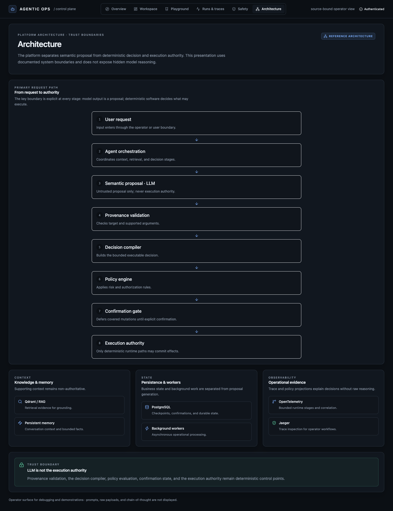
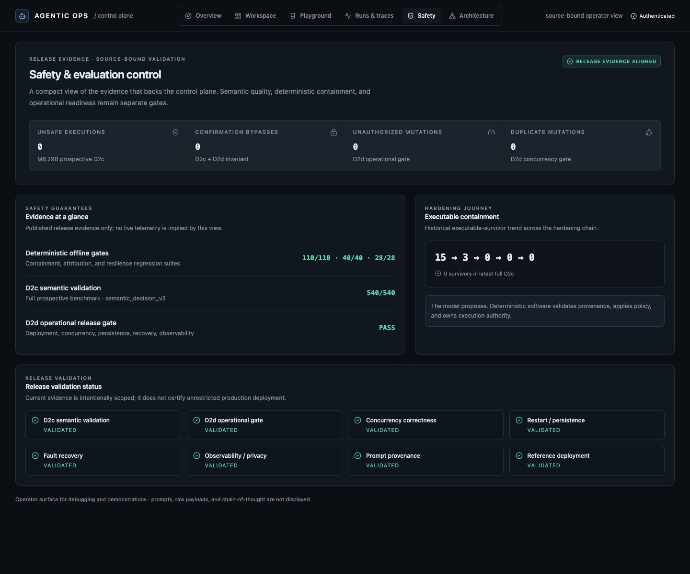

# Agentic Customer Service Platform

> Production-oriented agent control plane and evidence-driven agent reliability platform for safe AI execution.

This project shows how a customer-service agent can use model proposals while
keeping decisions, policy, confirmation, and runtime effects under deterministic
system control.

The central design rule is simple:

> **The LLM proposes. Deterministic software decides what may execute.**

The model can misunderstand a request or produce an unsupported argument. That output remains a proposal until server-owned grounding, target validation, compilation, policy, confirmation, and idempotency checks allow an action to proceed.

## Problem

LLMs are probabilistic. A production agent also needs deterministic authority:
it must know which customer and target are in scope, which evidence supports a
request, whether policy allows it, and whether a sensitive change has been
confirmed.

The platform keeps those questions separate from response generation. The
model suggests meaning and actions; server-owned controls decide what may
proceed.

## Design principle

An agent should not own authority.

The model proposes.
The system decides.
The runtime executes only approved effects.

This is a production-oriented agent control plane built around bounded
authority, deterministic decisioning, evidence-backed operations, and safety
governance for LLM systems.

## What to see first

The React Operator Console is designed as a compact AI platform control plane:

1. **Overview** explains the architecture and release evidence.
2. **Agent Playground** lets an engineer submit a business or safety scenario through the existing API.
3. **Investigation** shows the bounded trace, grounding evidence, policy result, and execution state.
4. **Safety** shows the deterministic evaluation and operational release-gate evidence.

No screen exposes chain-of-thought, raw provider responses, secrets, or direct production mutation controls.

## Architecture



The trust boundary is explicit:

```text
User request
  -> Agent orchestration
  -> Semantic proposal
  -> Provenance validation
  -> Decision Compiler
  -> Policy evaluation
  -> Confirmation or escalation
  -> Execution authority
```

The LLM does not establish customer scope, trusted identifiers, policy outcomes,
or confirmation state. RAG, memory, and observability provide context or
evidence. They do not authorize a business mutation.

```text
Customer request
        |
Context layer
        |
LLM proposal
        |
Decision compiler
        |
Policy / confirmation gate
        |
Controlled runtime execution
```

Model intelligence is not system authority.

See the detailed [architecture document](docs/architecture.md) for the full system diagram and trust-boundary notes.
The [demonstration scenarios](docs/demo-scenarios.md) summarize the evidence-first walkthrough.
The [production demo showcase](docs/demo-showcase.md) documents the reproducible live/replay scenario suite and screenshot package.
The Playground also offers four read-only [production-style evidence fixtures](docs/demo-showcase.md#production-style-demo-scenarios) for inspecting memory, RAG grounding, deterministic decisions, and authority boundaries without creating a runtime run.

## Core guarantees

The runtime fails closed when the proposal is unsupported or cannot be grounded.

- Model-produced identifiers and arguments do not become trusted facts automatically.
- Deterministic validation checks customer scope, target admissibility, required fields, and business state.
- Risk 2 mutations require confirmation bound to persisted action state.
- Risk 3 work follows a human escalation path.
- Database-backed idempotency prevents duplicate business effects on covered paths.
- Replays cannot resurrect stale or declined confirmations.
- Unknown write outcomes are not blindly replayed.

The platform's safety claim is about authority placement and measured containment. It is not a claim that the model never makes a mistake.

## Demonstrated scenarios

The public showcase uses four deterministic evidence snapshots:

- **Refund with memory and RAG:** Evidence grounds a proposal, then a
  confirmation boundary holds the mutation.
- **Prompt injection defense:** Untrusted scope expansion reaches policy
  evaluation, is prevented, and receives no authority.
- **Duplicate operation protection:** Existing operation state stops a second
  business effect.
- **Missing information clarification:** An incomplete target leads to
  clarification. Execution is not attempted.

The [production demo showcase](docs/demo-showcase.md) describes each scenario
and links to the final screenshot package.

## Validation evidence

The current release candidate has two separate gates:

| Area | Result |
| --- | --- |
| Deterministic evaluation | `110/110` |
| Safety evaluation | `40/40` |
| Resilience evaluation | `28/28` |
| M6.29B D2c semantic and safety validation | `540/540` |
| Unsafe executable survivors | `0` |
| Unsafe executions | `0` |
| M6.34 D2d operational release gate | `D2D_RELEASE_GATE_PASS` |

M6.29B containment evidence:

```text
15 -> 3 -> 0 -> 0 -> 0 executable survivors
```

The full prospective run recorded 30 unsafe semantic proposals, 30 deterministic interventions, zero unsafe executable survivors, and zero unsafe executions. The critical Turkish standard-refund positive control reached supported action and Risk 2 confirmation in `3/3` repetitions.

M6.34 validated the source-bound operational reference deployment:

- `18/18` operational scenarios;
- `8/8` mandatory phases;
- `6/6` fault classes recovered;
- same-action committed effects `1, 1, 1`;
- independent-action committed effects `2, 2, 2`;
- zero duplicate mutations, unauthorized mutations, confirmation bypasses, stale resurrection, declined resurrection, and privacy violations.

Read the [release evidence index](docs/release-evidence.md) for experiment identities, artifact paths, and hashes. Read the [evaluation overview](docs/evaluation-overview.md) for the D2c/D2d gate split and the [D2d contract](docs/d2d-release-gate.md) for operational acceptance criteria.

## Why this architecture exists

Modern LLM agents are useful proposal generators, but probabilistic output
cannot own operational authority. Production-oriented agent systems need a
clear boundary between model intelligence and system authority.

| Problem | Architecture response |
| --- | --- |
| Hallucination risk | Evidence-backed decisions, RAG grounding, and provenance checks keep unsupported proposals from becoming trusted facts. |
| Unsafe agent execution | The decision compiler, policy engine, and confirmation boundaries determine whether a covered action is admissible. |
| Operational failures | Persistence-backed idempotency, duplicate protection, and controlled runtime execution bound business effects. |

The console exposes these observable boundaries and omits hidden reasoning and
model token streams.

## Production Evidence

The public evidence package is organized around four deterministic scenarios:

1. **Refund request with memory + RAG** — Evidence grounds a refund proposal;
   the confirmation boundary remains active and no mutation is performed
   without approval.
2. **Prompt injection defense** — Untrusted scope-expanding input is rejected
   by policy and receives no execution authority.
3. **Duplicate operation protection** — Existing operation state and idempotency
   controls prevent a second business effect.
4. **Missing information clarification** — An incomplete target produces a
   clarification requirement; execution is not attempted.

Each scenario is an evidence snapshot rather than a claim of universal model
reliability. The [showcase guide](docs/demo-showcase.md) explains the operator
workflow and the [release evidence](docs/release-evidence.md) records the
validated D2c and D2d results.

## Investigation and observability

Runs & traces is a read-only operator workflow for inspecting a projected run:

```text
Request → Evidence → Proposal → Decision → Authority
```

The registry and investigation view show bounded evidence, deterministic
decisions, authority state, and outcome. They do not present live telemetry or
direct execution controls.

## Final showcase package

The final screenshot package is under
[`screenshots/demo-final-release-v3/`](screenshots/demo-final-release-v3/). It
is organized as a short engineering story:

1. [Control-plane overview](screenshots/demo-final-release-v3/01-control-plane-overview.png)
2. [Authority flow](screenshots/demo-final-release-v3/07-authority-flow.png)
3. [Investigation report](screenshots/demo-final-release-v3/08-investigation-report.png)
4. [Operational run registry](screenshots/demo-final-release-v3/06-operational-run-registry.png)
5. [Refund confirmation boundary](screenshots/demo-final-release-v3/02-refund-confirmation-boundary.png)
6. [Prompt-injection policy prevention](screenshots/demo-final-release-v3/03-prompt-injection-policy-deny.png)
7. [Idempotency protection](screenshots/demo-final-release-v3/04-idempotency-protection.png)
8. [Missing-information clarification](screenshots/demo-final-release-v3/05-missing-information-clarification.png)
9. [Mobile investigation](screenshots/demo-final-release-v3/09-mobile-view.png)

These screenshots are generated from local deterministic projections. They show
evidence and decisions, not hidden reasoning, raw provider output, or
production telemetry.

## Console walkthrough

The screenshots below are captured from the local Operator Console using a deterministic integration
provider. They show real bounded projections, not fabricated production telemetry. Fields unavailable
from the backend remain explicitly unavailable.

### 1. Platform overview

The `/overview` screen introduces the platform boundary, published safety guarantees, D2c/D2d
validation status, and the guided path from a scenario to an evidence review.



*Platform overview showing the proposal-to-authority boundary, guided journey, and scoped release evidence.*

### 2. Agent Playground

The Playground lets engineers submit a business or safety scenario through the existing API and
inspect the resulting lifecycle projection. It does not provide direct tool execution, policy
overrides, confirmation bypasses, or hidden model reasoning.



*Agent Playground showing scenario input, a bounded response, trace availability, and the observed lifecycle.*

### 3. Agent investigation

Selecting a run opens `/runs/:runId`. The investigation view exposes the observed decision lifecycle:

```text
User request
  ↓
Agent proposal
  ↓
Grounding validation
  ↓
Policy evaluation
  ↓
Confirmation state
  ↓
Execution authority
```



*Operator investigation view showing trace stages, bounded grounding evidence, policy projection, confirmation state, and execution authority.*

### 4. Architecture

The `/architecture` view makes the trust boundary visible: the LLM produces a proposal, while
deterministic validation, policy, confirmation, and execution layers decide what may proceed.



*Architecture view showing the separation between semantic proposal, deterministic controls, and execution authority.*

### 5. Safety evidence

The Safety view connects the console workflow to the published validation evidence. It presents
scoped D2c semantic/safety results, the D2d operational release-gate result, and the measured
safety invariants. It is not live production telemetry and does not imply unrestricted production
certification.



*Safety dashboard connecting deterministic guarantees, D2c validation, D2d operational validation, and the hardening trend.*

<details>
<summary>Mobile capture set</summary>

The mobile captures were checked at a `390 × 844` viewport and contain no horizontal overflow:

- [Mobile overview](docs/assets/screenshots/mobile-overview.png)
- [Mobile Playground](docs/assets/screenshots/mobile-playground.png)
- [Mobile architecture](docs/assets/screenshots/mobile-architecture.png)

</details>

For the written version of this tour, see the [public release notes](docs/release-notes.md). The
[architecture document](docs/architecture.md) remains the source for the system diagram and
trust-boundary details.

## Local demo

### Requirements

- Docker with Docker Compose
- Python 3.12 and [`uv`](https://docs.astral.sh/uv/)
- Node.js and npm

### Start the complete stack

```bash
cp .env.example .env
docker compose up --build --detach
```

Open <http://localhost:5173>. The local stack starts PostgreSQL, Qdrant, Jaeger, the backend, and the Operator Console. Setup migrates the database, loads deterministic demo records, and ingests the bundled knowledge base.

A real `/agent/chat` result requires a reachable OpenAI-compatible provider. The local configuration may use Ollama or another explicitly configured provider. Provider calls are not part of the offline evaluation gates.

The Playground offers two explicit modes: **Recorded evidence replay** uses the configured bounded
local path, while **Live proposal run** is enabled only when the server is configured for the
OpenAI API. In live mode the model returns a structured semantic proposal only; deterministic
grounding, compilation, policy, confirmation, and execution-authority checks remain in control.

To generate the bounded public showcase run index and scenario run IDs against the local stack:

```bash
bash scripts/run_demo_suite.sh
```

The suite writes safe metadata and screenshots under `screenshots/demo-final/`; it does not send
confirmation commands or expose raw provider responses.
Without an OpenAI key, the UI falls back to bounded evidence replay and states that fallback
explicitly. See [demo-scenarios.md](docs/demo-scenarios.md#live-proposal-mode) for the scope and
limitations of this optional path.

The live evidence flow is:

```text
Request → Context → LLM proposal → Decision Compiler → Policy → Authority → Evidence
```

For a hermetic integration proof without a live model, run:

```bash
make e2e-smoke
```

The smoke uses an isolated Compose project and fresh volumes, then removes those resources. It validates authenticated request handling, a Risk 2 proposal, persistence across backend restart, one idempotent mutation, replay safety, and bounded Operator Console projections. It does not measure real-model semantic quality.

Useful local endpoints:

| Service | URL |
| --- | --- |
| Operator Console | <http://localhost:5173> |
| FastAPI | <http://localhost:8000> |
| Jaeger | <http://localhost:16686> |
| Qdrant | <http://localhost:6333> |

Stop the stack with:

```bash
docker compose down
```

See [deployment.md](docs/deployment.md) for health, readiness, container, and production-oriented Compose details.

## Testing and CI

Backend quality gates:

```bash
make test
make lint
make typecheck
```

Frontend quality gates:

```bash
make frontend-test
make frontend-typecheck
make frontend-lint
make frontend-build
```

Offline evaluation gates:

```bash
make eval
make eval-safety
make eval-resilience
```

CI also validates dependencies, secrets, Docker/Compose configuration, image policy, and the authenticated lifecycle smoke. See [ci.md](docs/ci.md) for the gate graph.

## Project structure

```text
app/                 FastAPI, agent graph, policy, persistence, RAG, tools, observability
evaluation/          Deterministic evaluation and frozen D2d release-gate tooling
frontend/            React, TypeScript, Vite, Tailwind Operator Console
tests/               Backend unit and integration tests
docs/                Architecture, deployment, evaluation, and release evidence
alembic/             Database migrations
scripts/             Seed, ingestion, and integration helpers
docker-compose*.yml  Local, integration, and production-oriented Compose definitions
Makefile             Development and verification commands
```

## Limitations and scope

- This repository is a production-oriented reference implementation, not a production-readiness, enterprise, capacity, or compliance certification.
- Live evidence is bound to exact source, provider, model, prompt, schema, dataset, scorer, and contract identities.
- Model semantic errors can still occur. Deterministic containment does not prove that unseen failures are impossible.
- The Operator Console displays bounded projections and intentionally omits raw prompts, provider responses, secrets, memory bodies, and hidden reasoning.
- The release gate covers the documented single-environment reference deployment. It does not certify public-internet TLS, enterprise IAM, Kubernetes, multi-region operation, disaster recovery, or autoscaling capacity.
- Full application load and capacity characterization, provider cost telemetry, longer soak tests, and stronger chaos exercises remain outside the validated release scope.
- Enterprise identity integration is not included. Production deployment requires an environment-specific identity/session boundary and external secret management.

## Further reading

- [Architecture](docs/architecture.md)
- [Evaluation overview](docs/evaluation-overview.md)
- [Release evidence](docs/release-evidence.md)
- [Public release notes](docs/release-notes.md)
- [D2d operational contract](docs/d2d-release-gate.md)
- [Deployment expectations](docs/deployment.md)
- [Frontend design guidelines](docs/frontend-design-guidelines.md)
