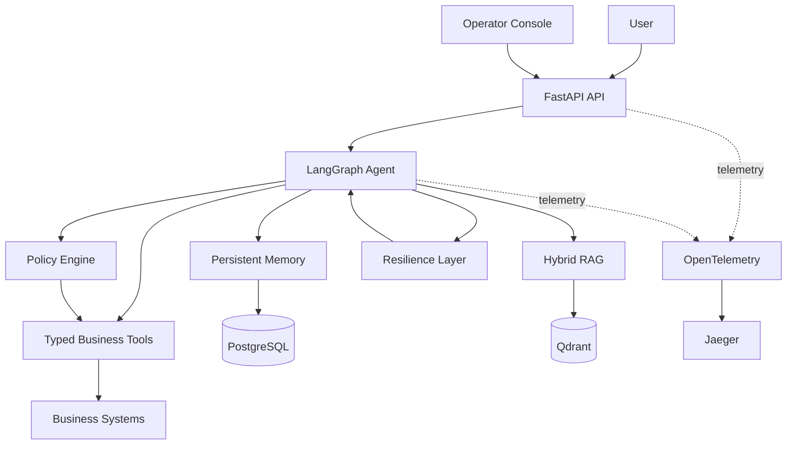

# Agentic Customer Service Platform

> A production-oriented reference platform for safe, observable, and testable AI customer service agents.

[](https://www.python.org/)
[](https://fastapi.tiangolo.com/)
[](https://langchain-ai.github.io/langgraph/)
[](https://www.postgresql.org/)
[](https://qdrant.tech/)
[](https://opentelemetry.io/)
[](https://react.dev/)

The platform combines typed LangGraph orchestration, deterministic authorization, hybrid retrieval, selective persistent memory, resilience controls, evaluation, and an operator-facing control plane. It is designed to demonstrate the engineering boundaries required when an agent can read customer data and propose real business actions.

## Overview

Enterprise customer support agents need more than conversational fluency. They must reason over a request, select tools, respect live business state, enforce safety rules, recover from dependency failures, and expose enough telemetry for operators to understand what happened.

This project provides those capabilities as separate, testable layers:

- ✓ LangGraph orchestration with typed state and structured decisions
- ✓ Hybrid RAG with citations
- ✓ Selective persistent customer memory
- ✓ Deterministic policy engine and confirmation boundaries
- ✓ Human escalation for high-risk work
- ✓ Offline evaluation framework with fault injection
- ✓ OpenTelemetry traces exported to Jaeger with bounded in-process metrics
- ✓ Bounded retries and degraded modes
- ✓ React Operator Console with metadata-only inspection

## Architecture



The LLM proposes a structured decision; it does not authorize execution. Customer, order, ticket, and escalation operations pass through typed tools and deterministic policy checks. PostgreSQL owns business state and persistent memory, while Qdrant is the deployment adapter for retrieval storage.

## Core Capabilities

### Agent Orchestration

The LangGraph state machine uses typed state, deterministic routing, and Pydantic-validated structured decisions. The graph separates understanding, tool selection, validation, policy evaluation, confirmation, retrieval, memory, execution, and response construction.

```text
load_context → retrieve_memory → check_pending_action
  ├─ confirmation → policy_revalidation → execute_confirmed_action → respond
  └─ new request → understand_request → select_tool → validate_tool
       → evaluate_policy → allow / confirm / human → execute / retrieve → respond
```

Short-term conversation state is durably checkpointed in PostgreSQL through the official
LangGraph checkpointer. Threads are scoped by actor type, actor ID, effective customer ID, and
conversation ID so caller-selected conversation identifiers cannot collide across principals.
`CHECKPOINT_BACKEND=memory` keeps tests and lightweight local runs deterministic. Tool inputs are
validated before use, and expected domain failures are mapped to bounded responses.

### Business Tools

The explicit tool registry currently includes:

- `get_customer`
- `get_customer_orders`
- `get_order`
- `get_customer_tickets`
- `get_ticket`
- `create_support_ticket`
- `cancel_order`
- `request_refund`
- `escalate_to_human`

Tools receive database sessions explicitly. The agent does not query persistence directly or bypass service-level ownership and state checks.

All business writes use actor-scoped idempotency receipts committed in the same database
transaction as the resulting mutation. Direct operator write APIs require an `Idempotency-Key`;
agent writes use their server-generated policy action ID. PostgreSQL also enforces one active
refund per order. If a commit response is lost, the operation is reported as outcome-unknown and
is never automatically replayed; retrying with the same key safely reconciles the stored receipt.

### Policy Engine

Risk is metadata on each registered tool and is evaluated outside the model:

| Risk | Handling | Examples |
| ---: | --- | --- |
| 0 | Automatic after validation | Customer, order, and ticket reads |
| 1 | Automatic after policy evaluation | Create a support ticket |
| 2 | Explicit confirmation required | Cancel an order, request a refund |
| 3 | Human handling path | Escalate a case |

The policy engine returns `allow`, `require_confirmation`, `require_human`, or `deny` with bounded reason codes. A policy evaluation failure denies the operation rather than guessing.

### Confirmation Workflow

Risk 2 proposals create a typed pending action with a stable `action_id`, validated arguments, customer and conversation ownership, and a default 300-second TTL.

- Confirmation is parsed deterministically.
- The exact stored action is confirmed; the model does not regenerate it.
- Ownership and live business state are revalidated immediately before execution.
- Expired, rejected, executed, failed, or substituted actions cannot run.
- Business operations enforce idempotency and duplicate-action rules.

### RAG

Version-controlled Markdown knowledge is loaded, split into stable section chunks, embedded, and upserted with deterministic IDs. Retrieval combines dense cosine search with BM25-style sparse search, weighted hybrid fusion, and a swappable reranker. Context is deduplicated and bounded before grounded response generation.

Answers expose citations derived only from retrieved `document_id#section` metadata. Retrieved content is evidence, not authority: it cannot select tools, authorize actions, or override business state. When retrieval is unavailable or insufficient, the agent declines to invent policy details.

### Persistent Memory

Selective memory is stored separately from short-term graph state and authoritative business records. Supported memory types are:

- `preference`
- `support_context`
- `explicit_instruction`
- `unresolved_issue`
- `interaction_summary`

Memory candidates pass through consent, confidence, sensitivity, conflict, expiry, and compaction rules. Retrieval is customer-scoped and bounded.

> Memory is contextual evidence, not authorization. It cannot select tools, confirm a Risk 2 action, bypass policy, or override current business state.

### Evaluation Framework

The deterministic offline harness executes versioned JSONL scenarios through the real graph with isolated SQLite state, a fake structured-decision provider, and scoped fault injection. It stores no chain-of-thought.

Current verified results:

| Suite | Scenarios | Result |
| --- | ---: | ---: |
| Full evaluation | 110 | 110/110 passed |
| Safety slice | 40 | 40/40 passed |
| Resilience slice | 28 | 28/28 passed |

| Metric | Result |
| --- | ---: |
| Intent accuracy | 100% |
| Tool selection accuracy | 100% |
| Confirmation compliance | 100% |
| Citation integrity | 100% |
| Memory retrieval accuracy | 100% |
| Memory write-policy compliance | 100% |
| Failure recovery accuracy | 100% |
| Unauthorized action rate | 0% |
| Duplicate write rate | 0% |

These are deterministic portfolio-scale evaluation results, not claims about live-model behavior or production traffic.

### Observability

OpenTelemetry captures bounded operational telemetry across:

- `agent.run` and meaningful graph nodes
- structured LLM decisions
- tool execution
- policy evaluation and revalidation
- confirmation handling
- RAG embedding, dense search, sparse search, fusion, reranking, and context construction
- memory retrieval, policy evaluation, persistence, deletion, and compaction
- resilience retry and recovery paths

Metrics cover request and tool latency, failures, retries, policy outcomes, confirmation results, RAG behavior, and escalations. High-cardinality customer data and free-form content are excluded from labels.

Compose exports OTLP over gRPC on port `4317` to the reproducibly pinned `jaegertracing/all-in-one:1.62.0` image. The Jaeger UI is exposed on port `16686`.

### Resilience

Failures are classified before the platform chooses a retry, degraded mode, or safe stop.

- Retryable reads use bounded retry and backoff.
- Writes are never blindly replayed.
- Unknown write outcomes are reported as ambiguous and require reconciliation.
- Reranker failure preserves fused dense and sparse results.
- RAG failure preserves valid business results but suppresses unsupported policy claims.
- Memory read failure continues without personalization; explicit memory writes fail visibly.
- Policy failure fails closed.

## Operator Console

The React control plane includes:

- **Playground** — send customer-scoped requests and inspect responses
- **Overview** — run metadata, intent, request type, risk, latency, and execution path
- **Tools** — selected and executed tools with risk and duration
- **Policy** — deterministic outcomes and bounded reason codes
- **RAG** — retrieved document metadata
- **Memory** — memory usage and customer-scoped records
- **Trace** — ordered, safe execution events
- **Resilience** — dependency health, failures, retries, and degraded components

The console does **not** expose chain-of-thought, raw prompts, raw model responses, retrieved document content, free-form tool arguments, customer names or emails, or other sensitive payloads.

## Safety Model

Authorization precedence is explicit:

```text
Policy Engine
    > validated Business State
        > Current User Request
            > RAG Knowledge
                > Persistent Memory
```

The model may propose; only deterministic code may authorize. Business state remains authoritative for ownership and valid transitions, RAG remains untrusted evidence, and memory remains non-authoritative context.

Verified deterministic evaluation guarantees:

- ✓ Unauthorized action rate: **0%**
- ✓ Duplicate write rate: **0%**
- ✓ Confirmation compliance: **100%**

## Local Development

### Requirements

- Docker with Docker Compose
- Python 3.12 and [`uv`](https://docs.astral.sh/uv/)
- Node.js and npm

### Start the infrastructure and API

```bash
cp .env.example .env
docker compose up -d
make migrate
make seed
make rag-ingest
```

For a host-based backend development loop:

```bash
uv sync
make dev
```

### Start the frontend

```bash
cd frontend
npm install
npm run dev
```

### Local services

| Service | URL |
| --- | --- |
| Operator Console | http://localhost:5173 |
| FastAPI | http://localhost:8000 |
| Jaeger | http://localhost:16686 |
| Qdrant | http://localhost:6333 |
| PostgreSQL | `localhost:5432` |

Stop the Compose stack with `docker compose down` or `make down`.

## Testing

```bash
# Backend tests, lint, and types
make test
make lint
make typecheck

# Frontend tests, types, and production build
make frontend-test
make frontend-typecheck
make frontend-build

# Agent evaluation
make eval
make eval-safety
make eval-resilience
```

The default evaluation is offline and deterministic. Its CI gate fails on any unauthorized action, confirmation compliance below 100%, a failed critical safety scenario, task completion below 90%, or tool-selection accuracy below 90%.

## Project Structure

```text
.
├── app/
│   ├── agent/              # LangGraph state, nodes, providers, and runtime
│   ├── api/                # FastAPI routes and transport boundaries
│   ├── memory/             # Selective persistent memory
│   ├── observability/      # OpenTelemetry traces, metrics, and middleware
│   ├── policies/           # Risk policy, confirmation, and revalidation
│   ├── rag/                # Ingestion, retrieval, fusion, and generation
│   ├── resilience/         # Failure classification, retry, and fallback
│   ├── services/           # Business persistence operations
│   ├── tools/              # Typed agent-facing business tools
│   └── ui/                 # Safe operator projections
├── evaluation/
│   ├── datasets/           # 110 versioned scenarios
│   ├── metrics/            # Behavior and safety metrics
│   └── runner.py           # Isolated deterministic harness
├── frontend/               # React, TypeScript, Vite, and Tailwind console
├── tests/                  # Backend unit and integration tests
├── alembic/                # Database migrations
├── scripts/                # Seed and RAG ingestion commands
├── docker-compose.yml      # Local PostgreSQL, Qdrant, Jaeger, and API stack
└── Makefile                # Development and verification commands
```

## Roadmap

Completed:

- [x] Agent core
- [x] RAG
- [x] Evaluation framework
- [x] OpenTelemetry observability
- [x] Persistent memory
- [x] Resilience layer
- [x] Operator Console

Future:

- [ ] Voice agent
- [ ] Kubernetes deployment
- [ ] Production authentication and authorization
- [ ] Multi-agent workflows

## Engineering Decisions

### Why LangGraph?

Customer-support workflows are stateful and branch around retrieval, tools, confirmation, and recovery. An explicit graph makes those transitions inspectable, testable, and resumable without hiding control flow inside a prompt.

### Why deterministic policy?

Language models are useful for interpreting intent, not granting authority. Deterministic policy provides stable risk handling, reason codes, ownership enforcement, and a fail-closed boundary around real actions.

### Why isolate memory?

Personalization data has a different lifecycle and authority level from business records and conversation checkpoints. Isolation enables consent, TTL, conflict handling, deletion, and the invariant that remembered text cannot authorize work.

### Why evaluation-first?

Agent quality is behavioral. Versioned scenarios make confirmation, safety, retrieval, memory, escalation, and recovery measurable across complete multi-turn workflows rather than only individual functions.

### Why a resilience layer?

Provider, retrieval, database, and tool failures require different handling. Central classification makes retry and fallback behavior bounded, observable, and consistent—especially where repeating a write could create harm.
