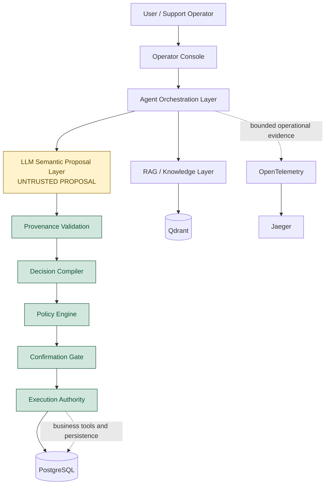

# Architecture Overview

The platform separates semantic suggestion from execution authority. The LLM produces an
untrusted proposal; deterministic server-side layers validate, authorize, persist, and execute
business effects.

> **LLM is not the execution authority.**

Trust boundaries:

- LLM output is proposal-only and cannot establish customer scope, trusted identifiers, policy
  outcomes, or confirmation state.
- Provenance validation, the Decision Compiler, and the Policy Engine are deterministic validation
  and authorization boundaries.
- The Confirmation Gate binds approval to persisted action state; the Execution Authority owns the
  final business mutation and its idempotency boundary.
- Qdrant/RAG, memory, and observability provide contextual or diagnostic evidence. None is an
  independent source of execution authority.

## Why LLM is not the execution authority

The platform separates four observable responsibilities:

- **Context:** Provides information only. Memory and RAG enrich understanding but cannot authorize
  actions.
- **Proposal:** The model produces semantic suggestions. Output remains untrusted.
- **Decision:** Deterministic layers validate provenance, policy, risk, and admissibility.
- **Authority:** Only controlled runtime paths can mutate state.

The Operator Console presents these boundaries without exposing chain-of-thought or hidden model
reasoning. For a short, evidence-scoped walkthrough, see the [demonstration scenarios](demo-scenarios.md).

## Runtime contract

The default runnable path uses `semantic_decision_v3`: the model emits a bounded semantic proposal,
and the server-owned grounding, admissibility, compiler, typed validation, policy, confirmation,
and execution layers retain authority. `direct_tool_v1` remains available only as an explicitly
selected compatibility contract for historical evaluation or legacy integrations.
